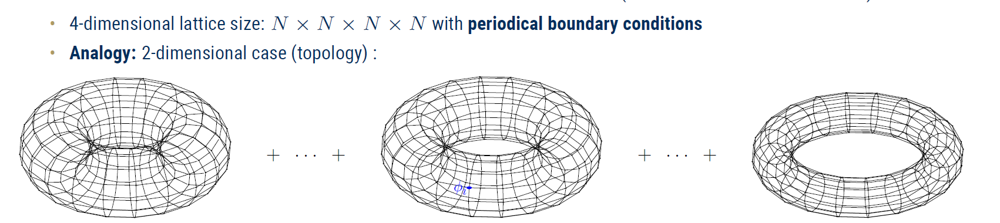

# Massive-free-field-on-dynamical-lattice-
Numerical study of a free massive scalar field coupled to a one-dimensional dynamical lattice, using both **brute-force** enumeration and **importance sampling** techniques.

  

---

🌟 Overview

This repository contains the numerical codes created during my [Master's thesis](https://www.db-thueringen.de/receive/dbt_mods_00067834) to study a background-independent toy model consisting of a free massive scalar field defined on a dynamical, irregular one-dimensional lattice with periodic boundary conditions. These investigations are presented here as notebooks writen entirely in **Julia**.

The lattice geometry is encoded in variable edge lengths, which are weighted by a Gaussian distribution. This setup provides a simplified, **spin-foam-inspired** model of fluctuating geometry that preserves the essential features of matter–geometry coupling while allowing explicit numerical evaluation.

At the core of the analysis is the proposed relational (diffeomorphism-invariant) two-point **correlation function ⟨ϕϕ(R)⟩** defined as a function of the geodesic distance **R** measured along the dynamical lattice.

Both implementations evaluate:

**Geometric expectation values**

-- Mean edge length ⟨ℓ⟩ and ⟨ℓ²⟩

-- Mean lattice volume ⟨V⟩ and ⟨V²⟩

-- Relational two-point correlation function ⟨ϕϕ(R)⟩​ binned as a function of the geodesic distance R.

---

⚙️ Numerical approaches

This repository contains two complementary implementations of the same model:

**Brute-force enumeration**

-- Explicit summation over all discrete lattice configurations

-- Finite discretization of edge lengths

-- Cyclic (rotational) symmetry of the lattice is exploited to remove redundant configurations

⚠️ Computational complexity scales as:

Cost∼ dimen**XS

This limits practical computations to small lattices (typically XS≤5). Thus, this approach was run in the Draco HPC.

**Importance sampling**

-- Edge lengths are sampled from a Gaussian distribution

-- Only relevant regions of configuration space are explored

-- Enables simulations of larger lattices

-- Improved statistics at large geodesic distances

This method is particularly suited for probing the long-distance behavior and robustness of the relational correlation function.

---

**Motivation**

The model is motivated by the coupled matter–geometry system studied in Chapter 3 of the thesis. While Markov Chain Monte Carlo methods can be applied to that system, their computational cost grows rapidly with lattice size, and large fluctuations appear at very short and very long distances.

The simplified model implemented here:

-- Retains the essential structure of matter–geometry coupling

-- Allows explicit computation of partition functions and expectation values

-- Enables controlled exploration of regions of configuration space that are otherwise inaccessible

-- Provides a clean testing ground for diffeomorphism-invariant observables

